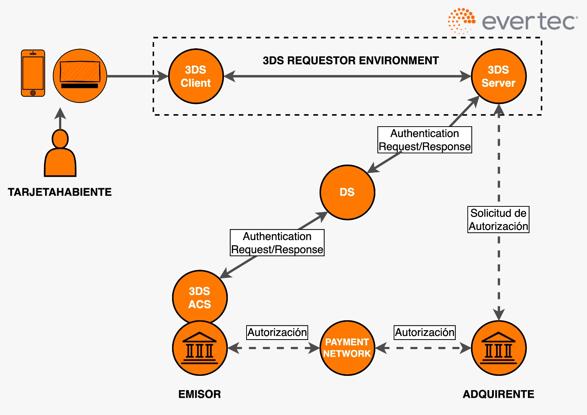
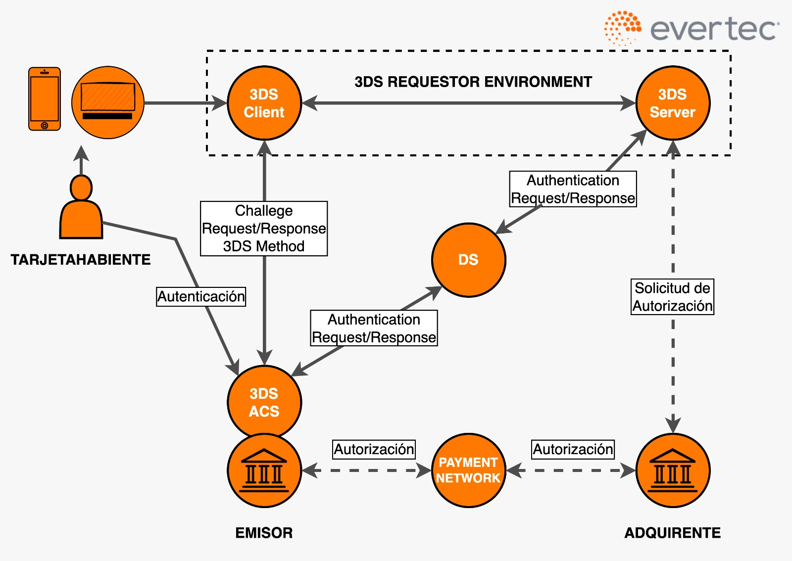

# ¿Qué es el Protocolo 3-D Secure?

El protocolo 3-D Secure (3DS) es un protocolo de seguridad utilizado en la industria de pagos en línea para realizar autenticaciones adicionales en transacciones con tarjetas de crédito y débito. El nombre "3-D Secure" proviene de "Three-Domain Secure", ya que el sistema involucra tres partes principales: el dominio del adquirente (comerciante y banco adquirente), el dominio del emisor (banco emisor y titular de la tarjeta) y el dominio de interoperabilidad (infraestructura de red y servidores que facilitan la comunicación entre las otras dos partes).

El objetivo principal de 3-D Secure es mejorar la seguridad de los pagos en línea y reducir el riesgo de fraude, al verificar la identidad del titular de la tarjeta durante las transacciones. Esto se logra mediante un proceso de autenticación adicional que puede incluir la solicitud de información adicional, como un código de seguridad temporal enviado al teléfono móvil del titular de la tarjeta.

El protocolo 3-D Secure es utilizado y respaldado por las principales redes de tarjetas de crédito y débito, como Visa, MasterCard, American Express, Discover y Diners, cada una de las cuales tiene su propia implementación del protocolo, conocida como Visa Secure, Mastercard Identity check, American Express SafeKey, ProtectBuy para el caso de Diners y Discover.

La versión más reciente del protocolo es 3-D Secure 2 (3DS2), que introduce mejoras significativas en la experiencia del usuario, reduce la fricción durante el proceso de pago y ofrece una mayor flexibilidad y capacidad de adaptación a los cambios en el entorno de pagos en línea.

| Versión del protocolo | Estado     |
|-----------------------|------------|
| 2.0.0                 | Inactiva   |
| 2.1.0                 | **Activa** |
| 2.2.0                 | **Activa** |
| 2.3.0                 | Inactiva   |
| 2.3.1                 | **Activa** |

**Nota:** "Activa" significa que EMVCo requiere realizar pruebas a los componentes 3DS. "Inactiva" indica que no hay soporte para pruebas EMVCo.

## ¿Cómo funciona 3-D Secure?

El protocolo 3D Secure (3DS) funciona como un paso adicional de autenticación para transacciones en línea realizadas con tarjetas de crédito.

1. **Inicio de la Transacción:** El titular de la tarjeta inicia una transacción en línea al seleccionar productos o servicios en el sitio web o aplicación del comerciante y procede al pago.

2. **Solicitud de Autenticación:** Una vez que el titular de la tarjeta ha ingresado los detalles de su tarjeta, el comerciante (a través del servidor 3DS del adquirente) envía una solicitud de autenticación al servidor de directorio (DS). El servidor de directorio determina qué banco emisor ha emitido la tarjeta y reenvía la solicitud de autenticación al servidor de control de acceso (ACS) del banco emisor.

3. **Proceso de Autenticación:** El ACS evalúa el nivel de riesgo de la transacción. Esto puede incluir la verificación de la dirección IP del titular de la tarjeta, el historial de transacciones, la ubicación geográfica, etc. Si la transacción se considera de bajo riesgo, se puede autenticar sin necesidad de intervención del titular de la tarjeta (autenticación sin fricción). Si la transacción se considera de alto riesgo, el ACS solicitará información adicional al titular de la tarjeta para confirmar su identidad. Esto puede incluir un código de un solo uso enviado por SMS, respuestas a preguntas de seguridad, reconocimiento biométrico, etc.

4. **Resultado de la Autenticación:** Una vez que se completa el proceso de autenticación, el ACS envía un mensaje con el resultado de la autenticación de vuelta al servidor 3DS del adquirente. El resultado puede ser una autenticación exitosa, un intento de autenticación o un fallo de autenticación.

5. **Finalización de la Transacción:** El comerciante recibe el resultado de la autenticación y procede a completar la transacción. Si la autenticación fue exitosa, el comerciante solicitará la autorización del pago al banco emisor. Si la autorización es exitosa, la transacción se completa y se realiza el pago.

6. **Confirmación:** Finalmente, el titular de la tarjeta recibe una confirmación de la transacción, ya sea a través del sitio web o aplicación del comerciante, o mediante una notificación o correo electrónico.

Este proceso ayuda a proteger contra el uso no autorizado de tarjetas de crédito en línea, al proporcionar una capa adicional de seguridad y autenticación.

## Flujos de autenticación

**Flujo sin Fricción**

**Flujo con Fricción**

